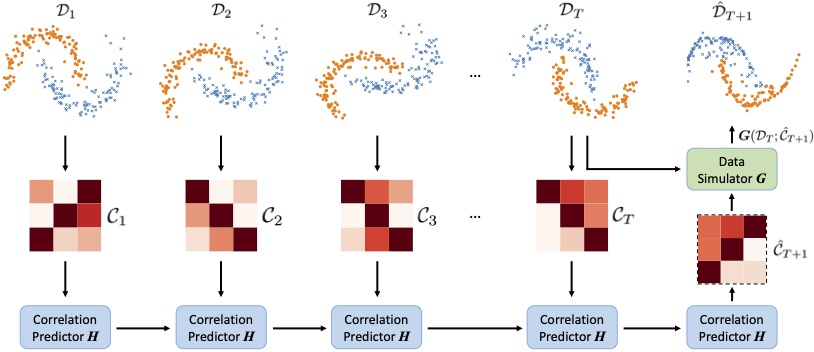

# CODA: Temporal Domain Generalization via Concept Drift Simulator

## 1. About this work
### Abstract
- In real-world applications, machine learning models are often notoriously blamed for performance degradation due to data distribution shifts. Temporal domain generalization aims to learn models that can adapt to "concept drift" over time and perform well in the near future. To the best of our knowledge, existing works rely on model extrapolation enhancement or models with dynamic parameters to achieve temporal generalization. 
However, these model-centric training strategies involve the *unnecessarily comprehensive* interaction between data and model to train the model for distribution shift, accordingly. To this end, we aim to tackle the concept drift problem from a data-centric perspective and naturally bypass the cumbersome interaction between data and model. Developing the data-centric framework involves two challenges: (i) existing generative models struggle to generate future data with natural evolution, and (ii) directly capturing the temporal trends of data with high precision is daunting. To tackle these challenges, we propose the <u>CO</u>ncept <u>D</u>rift simul<u>A</u>tor (CODA) framework incorporating a predicted feature correlation matrix to simulate future data for model training. Specifically, the feature correlations matrix serves as a delegation to represent data characteristics at each time point and the trigger for future data generation. Experimental results demonstrate that using CODA-generated data as training input effectively achieves temporal domain generalization across different model architectures with great transferability.


### DISPEL Framework
- An overview of the proposed framework CODA, consisting of a Correlation Predictor (see Section 3.2) and a Data Simulator (see Section 3.3). In the first stage, the Correlation Predictor is trained on feature correlation matrices at each time point $\mathcal{C}_{i}$. In the second stage, the predicted correlation matrix $\mathcal{\hat{C}}_{T+1}$ served as prior knowledge for Data Simulator $\boldsymbol{G}$ to be updated by Equation 5.
<div align=center>

</div>


## 2 Developed Environment and Dependency
- Please follow the settings in requirement.txt

## 3. Dataset and Trained Models Preparation
- Elec2 (classification task) and Appliance (regression task) datasets can be found in *data* folder.
- The CODA-generated datasets can be also found in *data* folder.

## 3. Experiment Reproducibility
- To reproduce the experimental results of CODA on the Elec2 dataset, please follow the instruction below:
```
$ bash ./classification/run_test_class_coda.sh
```

- To reproduce the experimental results of CODA on the Appliance dataset, please follow the instruction below:
```
$ bash ./regression/run_test_class_coda.sh
```
